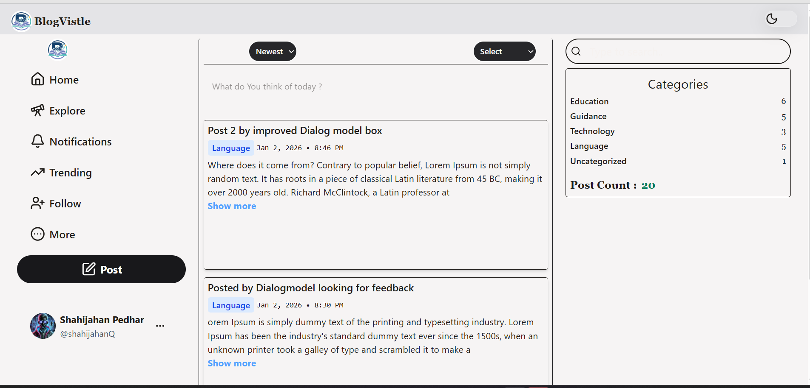
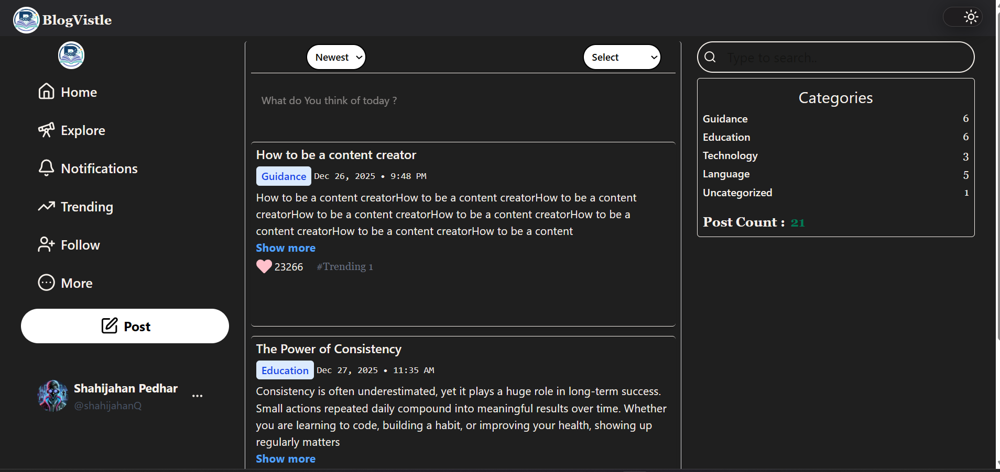

# 📝 Blog Project

A modern, feature-rich blog application built with React and Vite. Create, edit, search, and manage blog posts with a beautiful, responsive UI and theme switching capabilities.


## ✨ Features

### 📱 Core Functionality
- **Create Posts** - Write and publish blog articles with title, category, and content
- **Edit Posts** - Update existing blog posts with a dedicated edit interface
- **Single Post View** - Read individual blog posts in a focused view
- **Trending Posts** - Discover popular and trending content
- **Search & Filter** - Find posts quickly with search functionality
- **Category Sorting** - Organize posts by different categories
- **Post Sorting** - Sort posts by date, popularity, or other criteria

### 🎨 UI/UX Features
- **Dark/Light Theme** - Toggle between dark and light modes with smooth transitions
- **Responsive Design** - Mobile-friendly interface with dedicated mobile menu
- **Glass Morphism UI** - Modern glassmorphism design elements
- **Like System** - Engage with posts through likes and engagement tracking
- **Sidebar Navigation** - Easy navigation with left menu and sidebar
- **Interactive Components** - Tooltips, buttons, and smooth animations
- **Footer Section** - Comprehensive footer with additional information

### 🔧 Technical Features
- **Local Storage** - Persistent data storage using browser local storage
- **Slug Generation** - SEO-friendly URLs for blog posts
- **React Router** - Client-side routing for smooth navigation
- **Component Architecture** - Modular, reusable component structure
- **Theme Context** - Global theme management with React Context API
- **Icon Library** - Rich icon set with Lucide React and React Icons

## � Screenshots

### Light Mode - Desktop View

*Main blog feed with post listings, categories sidebar, and search functionality*

### Mobile Responsive View

*Optimized mobile interface with dark theme support*

### Dark Mode - Desktop View

*Beautiful dark theme with proper contrast and readability*

### Create Post Dialog

*Modal dialog for creating new blog posts with title, category, and content fields*

## �🚀 Getting Started

### Prerequisites
- Node.js (v14 or higher)
- npm or yarn package manager

### Installation

1. **Clone the repository**
   ```bash
   git clone <repository-url>
   cd Blog-project
   ```

2. **Install dependencies**
   ```bash
   npm install
   ```

3. **Start the development server**
   ```bash
   npm run dev
   ```

4. **Open your browser**
   Navigate to `http://localhost:5173` (or the port shown in your terminal)

### Build for Production

```bash
npm run build
```

The optimized build will be in the `dist` folder.

### Preview Production Build

```bash
npm run preview
```

## 📁 Project Structure

```
Blog-project/
├── src/
│   ├── components/
│   │   ├── BodyComponents/      # Layout components
│   │   │   ├── Footer.jsx
│   │   │   ├── LeftMenu.jsx
│   │   │   ├── MobileMenu.jsx
│   │   │   ├── Navbar.jsx
│   │   │   ├── Sidebar.jsx
│   │   │   └── Trending.jsx
│   │   ├── Buttons/             # Button components
│   │   │   ├── GlassSwitch.jsx
│   │   │   └── Likebtn.jsx
│   │   ├── FilterComponents/    # Search & filter
│   │   │   ├── Categorysorting.jsx
│   │   │   ├── Search.jsx
│   │   │   └── Sortpost.jsx
│   │   ├── PostComponents/      # Post management
│   │   │   ├── CreatePost.jsx
│   │   │   ├── Editpost.jsx
│   │   │   ├── Posts.jsx
│   │   │   └── SingleBlogView.jsx
│   │   ├── Resuables/          # Reusable utilities
│   │   │   └── Tooltip.jsx
│   │   └── Theme/              # Theme management
│   │       ├── ThemeContext.jsx
│   │       └── ThemeSwitch.jsx
│   ├── pages/                  # Page components
│   │   ├── Home.jsx
│   │   └── PagenotFound.jsx
│   ├── assets/                 # Static assets
│   ├── App.jsx                 # Main app component
│   ├── main.jsx               # Entry point
│   └── index.css              # Global styles
├── public/                     # Public assets
├── index.html                 # HTML template
├── package.json              # Dependencies
├── vite.config.js           # Vite configuration
├── tailwind.config.js       # Tailwind configuration
└── eslint.config.js         # ESLint configuration
```

## 🛠️ Technologies Used

### Frontend Framework
- **React 19.1.1** - Modern UI library with latest features
- **React DOM 19.1.1** - React rendering for web
- **React Router DOM 7.10.0** - Client-side routing

### Styling
- **TailwindCSS 4.1.17** - Utility-first CSS framework
- **@tailwindcss/vite 4.1.17** - Vite integration for Tailwind

### Icons & UI
- **Lucide React 0.562.0** - Beautiful, consistent icons
- **React Icons 5.5.0** - Popular icon library

### Utilities
- **Slugify 1.6.6** - Generate URL-friendly slugs
- **PropTypes 15.8.1** - Runtime type checking

### Build Tools
- **Vite 7.1.7** - Next-generation frontend tooling
- **@vitejs/plugin-react 5.0.4** - React plugin for Vite

### Code Quality
- **ESLint 9.36.0** - JavaScript linting
- **eslint-plugin-react-hooks** - React Hooks linting rules
- **eslint-plugin-react-refresh** - React Fast Refresh support

## 📄 Available Routes

| Route | Component | Description |
|-------|-----------|-------------|
| `/` | Home | Main blog feed with all posts |
| `/post` | CreatePost | Create a new blog post |
| `/article/:slug` | SingleBlogView | View individual blog post |
| `/edit/article/:slug` | EditPost | Edit existing blog post |
| `/trending` | Trending | View trending posts |
| `*` | PagenotFound | 404 error page |

## 💾 Data Storage

This application uses **browser Local Storage** to persist blog posts and user preferences. Data structure includes:

- **Post Data**: Title, slug, category, content, date, time, engagement metrics
- **Theme Preference**: Dark/light mode selection
- **User Interactions**: Likes and engagement tracking

## 🎨 Theme System

The app features a comprehensive theme system:
- **Light Mode**: Clean, bright interface
- **Dark Mode**: Eye-friendly dark theme
- **Smooth Transitions**: Animated theme switching
- **Persistent Preference**: Theme choice saved to local storage
- **Context-based**: Global theme state using React Context API

## 🤝 Contributing

Contributions, issues, and feature requests are welcome!

1. Fork the project
2. Create your feature branch (`git checkout -b feature/AmazingFeature`)
3. Commit your changes (`git commit -m 'Add some AmazingFeature'`)
4. Push to the branch (`git push origin feature/AmazingFeature`)
5. Open a Pull Request

## 📝 Scripts

```bash
# Start development server
npm run dev

# Build for production
npm run build

# Preview production build
npm run preview

# Run ESLint
npm run lint
```

## 📦 Installation Commands

```bash
# Using npm
npm install

# Using yarn
yarn install

# Using pnpm
pnpm install
```

## 🐛 Known Issues

- None reported yet

## 🔮 Future Enhancements

- [ ] User authentication and authorization
- [ ] Backend API integration
- [ ] Database storage (MongoDB/PostgreSQL)
- [ ] Comment system
- [ ] Social media sharing
- [ ] Rich text editor for posts
- [ ] Image upload functionality
- [ ] User profiles and author pages
- [ ] Tags and advanced filtering
- [ ] Draft post saving
- [ ] Search optimization
- [ ] Analytics dashboard

## 📧 Contact

For questions or support, please open an issue in the repository.

## 🙏 Acknowledgments

- React team for the amazing framework
- Vite for blazing fast development experience
- TailwindCSS for the utility-first CSS approach
- Lucide and React Icons for beautiful iconography

---

**Built with ❤️ using React and Vite**