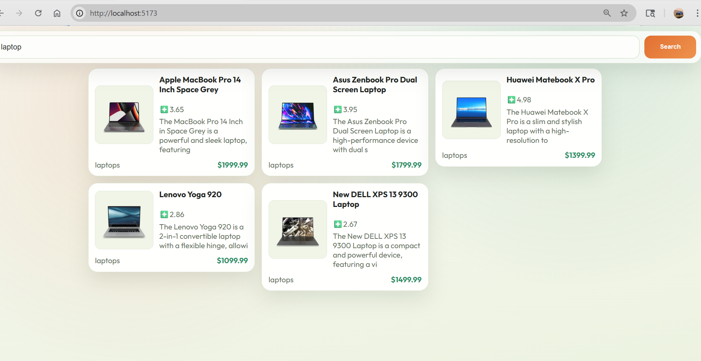
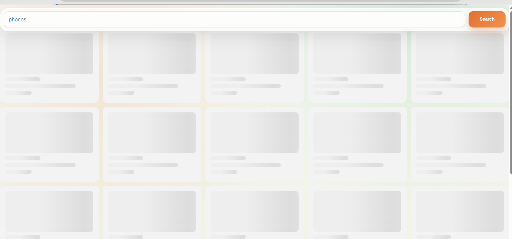

# Product Search App (React + TypeScript + Redux)

A responsive product search app built with React, TypeScript, and Redux Toolkit.
It fetches product data from the DummyJSON API and renders polished product cards with loading skeletons and error handling.

## Features

- Search products by keyword (for example: `phones`, `laptops`)
- Global state management with Redux Toolkit
- Loading skeleton UI while fetching data
- Friendly empty state when no products are found
- Error state UI for failed API requests
- Responsive layout for desktop and mobile

## Tech Stack

- React 19
- TypeScript
- Redux Toolkit + React Redux
- Vite
- CSS (custom styling)

## API

The app uses the DummyJSON product search endpoint:

```txt
https://dummyjson.com/products/search/?q=<query>
```

## Run Locally

1. Install dependencies:

```bash
npm install
```

2. Start the development server:

```bash
npm run dev
```

3. Open the local URL shown in terminal (usually `http://localhost:5173`).

## Build for Production

```bash
npm run build
```

## Preview Production Build

```bash
npm run preview
```

## Screenshots

Add your screenshots in a folder like `public/screenshots/` and update paths if needed.





## Project Structure

```txt
src/
  components/
    ApiData.tsx
    DataPresenter.tsx
    GridProducts.tsx
    SearchBar.tsx
    SkeletonCard.tsx
  provider/
    Store.ts
    features/
      fetchData.ts
      search.ts
  App.tsx
  main.tsx
```
